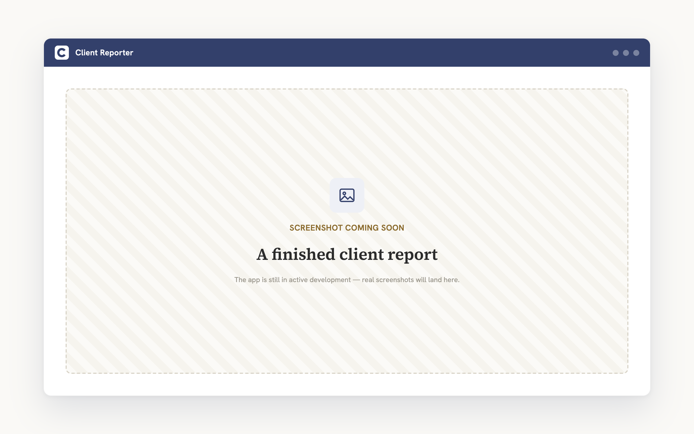
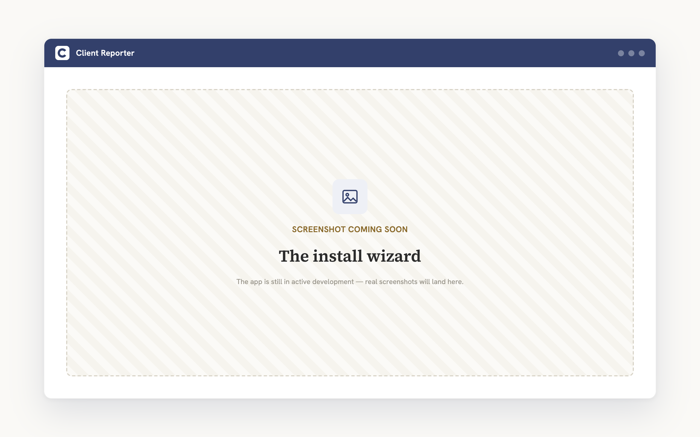
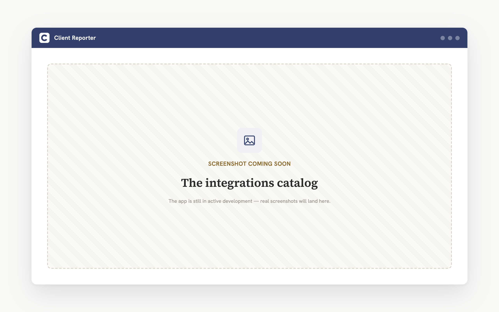
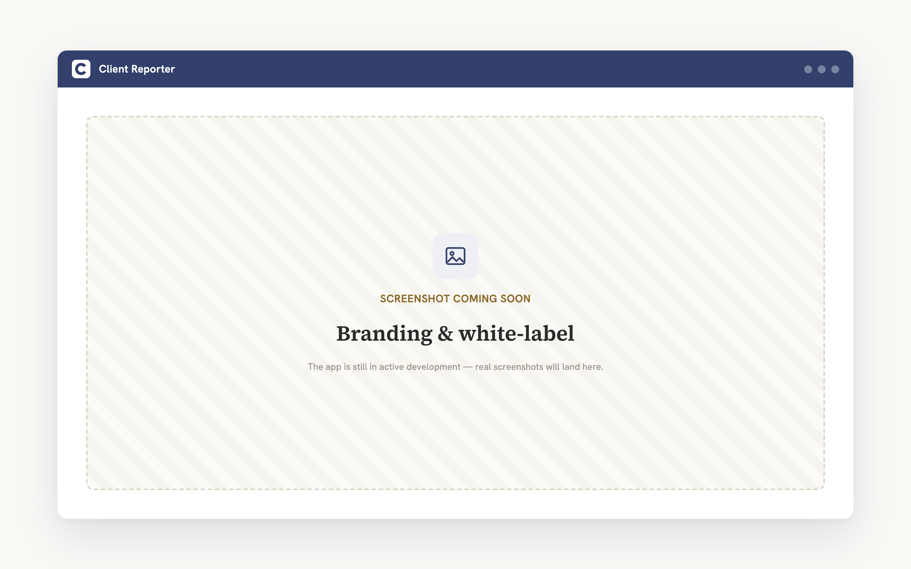

# Client Reporter


**Free, self-hosted client reporting for web agencies and freelancers.**

Client Reporter plugs into the services your clients' sites already run on — their CMS, analytics, shop, uptime monitor — pulls the numbers in on a schedule, and turns them into a clean, branded report you can hand over with your name on it.


## Why this exists

I got tired of paying a monthly fee, per client, to a SaaS just to send people a tidy monthly report — and of the data living on someone else's server. So I built the thing I wanted: you host it, you own the data, and it's free. No seats, no per-client pricing, no licence keys, nothing to phone home.

One install is for one agency. It's not a multi-tenant SaaS, and it's not trying to be everything — it does client reporting and tries to do that one thing really well.

Heads up: it's early. Client Reporter is at v0.1.0 and under active development, so expect a few rough edges and do give it a test run before you point real clients at it.

## Is it for you?

Probably, if you're:

- a **web agency** looking after a bunch of client sites who wants a consistent, professional report to send each month, or
- a **freelancer** who'd rather give clients a proper branded report than pay a SaaS subscription for the privilege.

## What you get

- A simple way to organise everything: **Client → Sites → Integrations → Data → Reports**.
- Connections to the CMS, analytics, ecommerce, monitoring and more behind each site (20 integrations so far — see below).
- Data collected on a schedule by Laravel's scheduler, so there's nothing to babysit — it's happy on cheap shared hosting.
- **Fully white-label** reports: your logo, your colours, your name. Your clients never see a Client Reporter logo anywhere.
- Sensible roles for your team — **Administrator**, **Manager**, **Viewer** — plus a locked-down **client portal** for the people you report to.



## What it deliberately doesn't do

Keeping the scope tight is a feature, not laziness. On purpose, Client Reporter is **not**:

- a deployment tracker, server monitor, or anything that SSHes into boxes
- a backup, malware-scanning, or "update all the plugins for me" tool (the companion plugins are **read-only** — it never changes your clients' sites)
- its own uptime monitor (it plugs into UptimeRobot, Uptime Kuma or Better Uptime instead)
- an AI commentary generator — the plain-English summaries are worked out straight from your numbers, so there's nothing to hallucinate
- your invoicing or accounting system (it keeps a light invoice ledger and can pull invoices in from FreeAgent or Xero *just* so they can show up in a report — that's it)
- a CRM, a project manager, or an integration marketplace

If you need one of those, there are great dedicated tools for it — this happily stays in its lane.

## What you'll need

- PHP 8.3+
- Composer
- Node.js and npm (to build the front-end assets)
- A database — SQLite (the easy default), MySQL/MariaDB, or PostgreSQL
- A web server that can serve the `public/` folder

No Docker, no Redis, nothing exotic. On shared hosting a single cron line runs the whole show:

```
* * * * * php /path/to/artisan schedule:run
```

On a VPS you *can* run a persistent queue worker if you like, but you don't have to. PDFs render with dompdf out of the box (no binaries, shared-host friendly), and you can switch to Browsershot on a VPS if you want pixel-perfect output.

## Getting it running

```bash
git clone https://github.com/coysh-digital/client-reporter.git
cd client-reporter
composer install
npm install && npm run build
```

Then point your web root at `public/`, open the site in your browser, and the install wizard walks you through the rest.



There's a full step-by-step guide in [docs/installation](docs/installation/README.md) if you'd like more detail.

## Integrations

Here's everything that's bundled in so far, by category:

| Category      | Integrations                                                          |
| ------------- | --------------------------------------------------------------------- |
| CMS           | WordPress, Craft CMS                                                   |
| Analytics     | Google Analytics 4, Google Ads, Plausible, Fathom, Matomo, Umami      |
| Search        | Google Search Console                                                  |
| Ecommerce     | WooCommerce, Craft Commerce, Shopify, Stripe                          |
| Forms & Leads | Mailchimp                                                              |
| Monitoring    | UptimeRobot, Uptime Kuma, Better Uptime                               |
| Performance   | PageSpeed Insights                                                     |
| Billing       | FreeAgent, Xero                                                        |



Most of these you can connect **once for the whole workspace** — one API key or one Google login — and Client Reporter will match them up to your sites and clients automatically, or you can wire them up per site if you prefer.

WordPress and Craft connect through small companion plugins that live in their own repos — [client-reporter-wordpress](https://github.com/coysh-digital/client-reporter-wordpress) and [client-reporter-craft](https://github.com/coysh-digital/client-reporter-craft). They only ever hand back **read-only** data, over HMAC-signed requests.

Already managing your sites somewhere else? You can **bulk-import** them from MainWP, ManageWP or WPMgr so you're not typing them all in by hand.

## White-labelling

This is the bit I most wanted to nail. Client-facing reports can be branded completely as your agency — your logo, your colours, your name — with zero Client Reporter references anywhere a client can see. As far as they're concerned, the report is yours.



Branding cascades from global → per-client → per-site, so you can set a house style once and tweak it for individual clients. There's more in [docs/branding](docs/branding/README.md).

## Keeping it updated

Updating is just pulling the latest code and running a couple of steps — full details in [docs/updating](docs/updating/README.md). Client Reporter also checks GitHub for new releases and gives you a heads-up in the admin when one's out.

## Writing your own integration

Missing a service you use? You can add it. Client Reporter has a small Integration SDK, and integrations are just Composer packages discovered via `extra.client-reporter.integrations`. There's a generator to scaffold one for you:

```bash
php artisan client-reporter:make-integration "Your Service"
```

The [creating an integration](docs/creating-an-integration/README.md) guide walks through the whole thing.

## Documentation

The full docs live in [docs/](docs/README.md) — installation, configuration, shared hosting, the reporting and branding guides, every integration, the security model, and how to build your own integration.

## Want to help?

Contributions are genuinely welcome — code, docs, bug reports, or just telling me what's confusing. Have a read of [CONTRIBUTING.md](CONTRIBUTING.md) for how to get set up and the coding standards, and the [Code of Conduct](CODE_OF_CONDUCT.md) while you're at it.

## Found a security issue?

Please don't open a public issue for it. Instead, use GitHub's private vulnerability reporting — the details are in [SECURITY.md](SECURITY.md). Thank you for reporting responsibly.

## Licence

Client Reporter is open source under the [MIT licence](LICENSE) — use it, fork it, ship it, whatever you need.

Copyright (c) 2026 Tim Coysh
