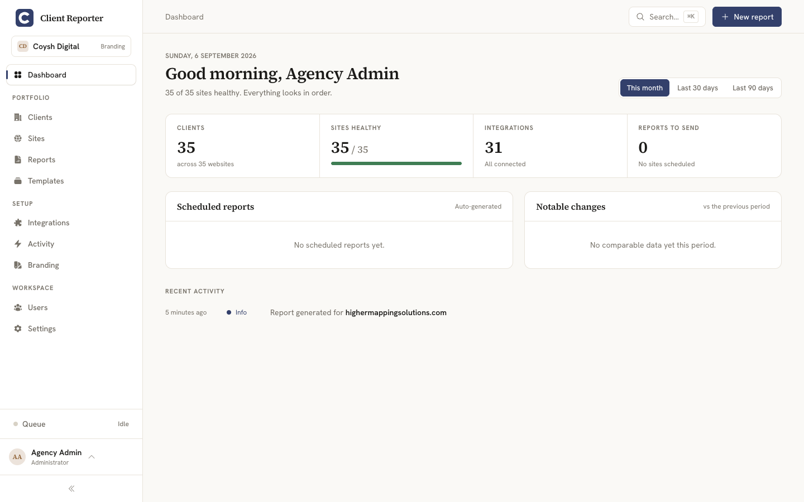

# Client Reporter documentation

Hello, and welcome to the docs. Client Reporter is open-source, self-hosted client reporting for web agencies — you point it at the services behind your clients' sites (their CMS, analytics, shop, uptime monitor) and it turns the numbers into clean, branded reports you can hand over with your name on them.

## Getting started

- [Installation](installation/README.md) — install Client Reporter and run the install wizard.
- [Shared hosting](shared-hosting/README.md) — running Client Reporter on shared hosting with a single cron entry.
- [Updating](updating/README.md) — keeping your installation up to date.
- [Configuration](configuration/README.md) — databases, drivers, PDF rendering and other settings.

## Using Client Reporter

- [Reports](reports/README.md) — building, scheduling and sharing client reports.
- [Branding](branding/README.md) — fully white-labelling your client-facing reports.

## Integrations

Client Reporter talks to the services behind your clients' sites, spread across eight categories — CMS, Analytics, Search, Ecommerce, Forms & Leads, Monitoring, Performance and Billing.

- [Integrations overview](integrations/README.md) — how integrations work, the auth methods, workspace ("connect once") connections, encrypted credentials, and the full bundled set.
- [WordPress](wordpress/README.md) — the WordPress companion plugin integration (read-only, HMAC-signed).
- [Craft CMS](craft/README.md) — the Craft CMS companion plugin integration (read-only, HMAC-signed).
- [Analytics](analytics/README.md) — Google Analytics 4, Google Ads, Plausible, Fathom, Matomo and Umami.
- [UptimeRobot](uptime-robot/README.md) — uptime monitoring via UptimeRobot, Uptime Kuma and Better Uptime.

Also bundled and covered in the [integrations overview](integrations/README.md): **Search** (Google Search Console), **Ecommerce** (WooCommerce, Craft Commerce, Shopify, Stripe), **Forms & Leads** (Mailchimp), **Performance** (PageSpeed) and **Billing** (FreeAgent, Xero).

## Ask an AI about your data

- [MCP server](mcp/README.md) — point an AI assistant (Claude Desktop, Claude Code, etc.) at your install and ask read-only questions about your clients, sites, reports and metrics.

## Extending Client Reporter

- [Development](development/README.md) — contributing to the core application.
- [Creating an integration](creating-an-integration/README.md) — building an integration with the Integration SDK.

## Security

- [Security](security/README.md) — the security model and how to report vulnerabilities.
